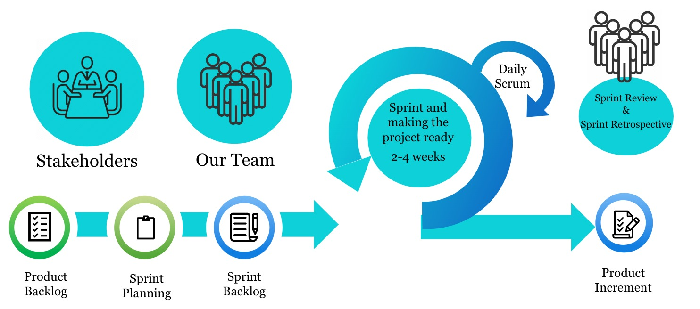
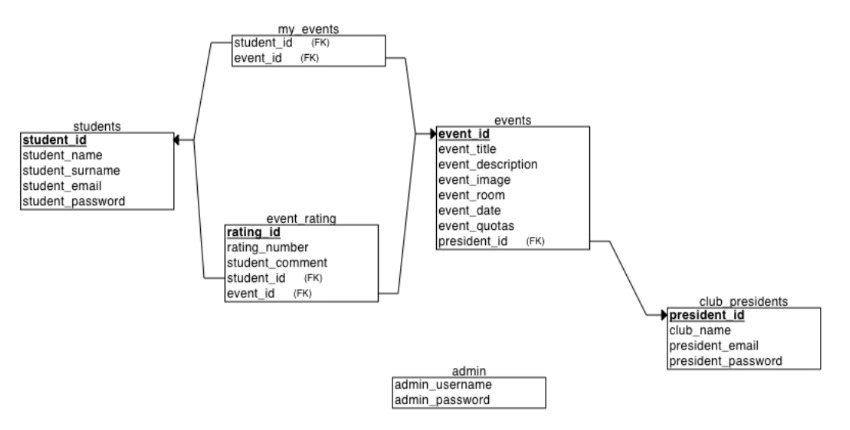
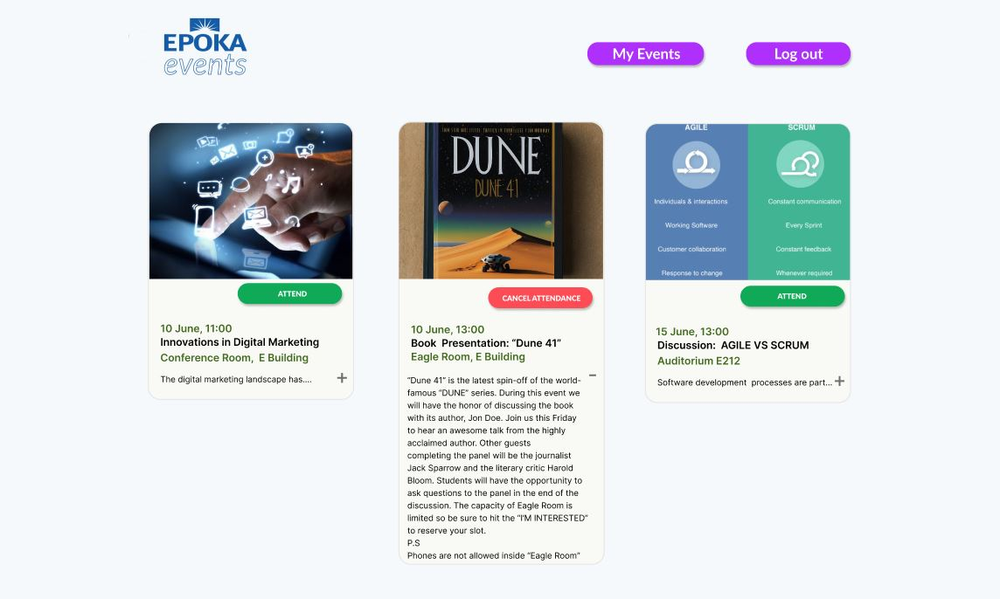

# EpokaClubEvents
GitHub Submission Template: Group Division (Phase I) # Team Information
## Team Name: [Club Events Team]

## Team Leader:
- **Name:** [Rubin Haxhiu]
- **GitHub Username:** [RubinHaxhiuEpoka]

## Team Members:
1. [Rubin Haxhiu] - GitHub: [RubinHaxhiuEpoka]
2. [Ardian Ismailaga] - GitHub: [Ardianepoka]
3. [Enio Yzeiri] - GitHub: [EnioYzeiriEpoka]
4. [Florian Alla] - GitHub: [florepoka]
5. [Mikel Muça] - GitHub: [mikelmuca]

# Project Details

## Project Title: [Epoka club events]

## Problem Statement:
[Every year, Epoka University organizes a gathering called "Club Fest," where students can sign up for different clubs. These clubs plan a wide variety of events all year long. Nevertheless, a noticeable problem occurs following "Club Fest". The most popular method for announcing major club events is through emails, however if you sign up for a particular club, these clubs will typically use their WhatsApp groups and occasionally Instagram accounts  to announce their upcoming events. It is important to note that Epoka students are only notified about the clubs they have initially joined on “Club Fest” , so they may miss out on other club events that they could find intriguing. We consider this current method of communication to be inconvenient, as it often causes a large number of students to miss out on club activities.]

## Solution Proposed:

[Similar to how Epoka has a specific webpage where its students can view their course schedule, we are considering developing an application especially designed to manage the university club events.The presidents of each club would be able to use this app to systematically and effectively announce their own club events. The primary target group for this application would be the students , who would be able to effortlessly browse through a comprehensive list of upcoming events. They could then select and confirm their attendance for the events that align with their interests and schedule.Similar to how Epoka has a specific webpage where its students can view their course schedule, we are considering developing an application especially designed to manage the university club events.The presidents of each club would be able to use this app to systematically and effectively announce their own club events. The primary target group for this application would be the students , who would be able to effortlessly browse through a comprehensive list of upcoming events. They could then select and confirm their attendance for the events that align with their interests and schedule.]

## Project Scope:

[The project's scope is to develop an application for students , so that they can easily attend club events in the university. They will need to sign up or login with their Epoka email addresses (@epoka.edu.al) . In the app there will be a club president page for club event management and displaying event attendance quotas for each respective event. The app will have a sorting event feature using filters to display the events . It will also include an admin page that manages all of the respective club presidents  as well as all of the events featured in the app.
The program is developed using React , Express.js  and PostgreSQL. It features a user-friendly interface where students can easily and effortlessly choose the desired event that they want to attend.Additionally the app will include a feedback system after the events finish so students are able to inform the clubs for their experiences in the events.]

- **Aim:** 
[ The aim of this project is to develop an application that simplifies event planning  for Epoka University students and club presidents.]

- **Main Objectives:**
1. [Make event management easier for Epoka University students and club presidents]
2. [Give club presidents an easy-to-use platform to post, edit, and manage events]
3. [Make it simple for students to find and participate in these events]
4. [Encourage higher engagement and participation in club activities]

## Application Description:

[ We are going to develop a web application that will help students of Epoka to be more in touch with the university's club events. We will use “react” to develop the frontend and “expressJs” to develop the backend of our application. We will also use “PostgreSQL” in order to create our databases for this project. In this application , students will be able to sign up on the platform by using their Epoka emails (@epoka.edu.al ). In the home page the events will be listed in descending order filtered by date but we plan to implement a button named ‘Filter By’ in order to help students list the events by date or club either in ascending or descending order , as they prefer. The app will have a feedback system where the students who have attended a specific club event will be able to rate it and give their feedback to the respective club presidents. The lowest rating will be 1 star and the highest rating will be 5 stars and also the students will be able to write a comment as a feedback about the event. The events will have a limited number of quotas specified by the presidents of clubs when they create the event and also in every event there will be an ‘Attend’ button and every time a student presses that button the number of quotas will go down by 1. The application will also include an admin page that is going to manage all of the respective club presidents as well as all of the events featured in the app.]

# Roles and Tasks Distribution

## Team Leader: [Rubin Haxhiu]

[Role :  Leader , Project manager , Full Stack Developer
Tasks and responsibilities : 
i) Manage the project repository on github
ii) Ensure project success by guiding the team members on their designated roles and tasks
iii) Work on both Frontend and Backend development codes provided by the team members of the group and merge all of the codes together in order to test and run the application]

## Main Roles and Tasks:

1. [Rubin Haxhiu ] 

[Role :  Leader , Project manager , Full Stack Developer
Tasks and responsibilities : 
i) Manage the project repository on github
ii) Ensure project success by guiding the team members on their designated roles and tasks
iii) Work on both Frontend and Backend development codes provided by the team members of the group and merge all of the codes together in order to test and run the application]

2. [Ardian Ismailaga ] 

[Role :  Frontend Developer
Tasks and responsibilities : 
i) Create the architecture of how the application is going to look like and how it will function along with Florian]

3. [Enio Yzeiri] 

[Role :  FullStack Developer
Tasks and responsibilities : 
i) Create the databases designated for the admin, club presidents, events and make the connection between the front-end and back-end functionalities for this database group
ii) Assist Rubin on both Frontend and Backend development codes.]

4. [Florian Alla]

[Role :  Frontend Developer
Tasks and responsibilities :
i) Handle the styling and css design of the user interface for the application 
ii) Assist Ardian in creating the architecture of how the application is going to look and how it will function.]

5. [Mikel Muça] 

[Role :  Backend Developer
Tasks and responsibilities : 
i) Create the databases designated for the students,clubs and make the connection between the front-end and back-end functionalities for this database group]

# Deadline
Submission Deadline: 04.03.2023, 23:59 hours.

# Phase II: User Requirements and Application Specifications

**Submission Deadline: 18.03.2024, 23:59**

## 1. Chosen Development Model:

Development Model chosen: **Scrum**
With its incremental and iterative design, Scrum is a great fit for our club event system project. So of the reasons why we choose Scrum over the other development models are the following:

### 1. Flexibility and Adaptability: 
Scrum is highly adaptable to changes. So in our club event system, requirements can change frequently based on feedback from club presidents, administrators, and event participants. Because Scrum is an iterative process, the team may take this feedback into account and adjust as needed during each sprint.

### 2. Incremental Delivery: 
Scrum encourages the creation and delivery of a product increment that might be shipped at the conclusion of each sprint. This permits stakeholders to view and utilize the system at an early stage of development and allows for early and continuous delivery of value.

### 3. Collaboration and Communication: 
Scrum promotes cooperative decision-making and active stakeholder participation.This is especially helpful in a university setting because effective teamwork and communication among students, club members, and administrators are essential for the project to succeed.

### 4. Risk Reduction: 
Scrum facilitates early risk detection and reduction by enabling frequent inspection of the process. This is essential for our project because it may assist in resolving any possible problems or difficulties with permissions, data security, user roles, event management, and other relevant topics.

### 5. Continuous Improvement: 
Scrum's integrated tools for reflection and adaptation, such as the Sprint Review and Sprint Retrospective, allow the team to continuously enhance the process, and the final product. By doing this, our club event system will be able fulfill future requirements in addition to meeting present ones.
By using Scrum, our team is able to collaborate efficiently,adjust to changes and continuously enhance the system to make sure it fulfills its intended function as a club events web application.

## 2. User Requirements:

### a. Stakeholders:

**Administrators :**

* Admin - is going to manage all of the respective club presidents as well as all of the events featured in the application.

**End Users :**

* Students - are able to choose desired club events that they are interested in participating, as well as provide their feedback
* Club Presidents - are able to to post, edit, and manage events

**Relevant Parties :**

* Epoka clubs
* Club Presidents
* General student body
* Development team

With the help of this project idea these relevant parties will be able to have an easier event management system for Epoka University students and club presidents. As well as help increase the overall engagement and participation in club activities.

### b. User Stories:

1. Administrator User Stories:
* An administrator wants to oversee and change every event to enable effective facilitation of club activities.
* An administrator needs access to all student information and their feedback , in order to evaluate the effectiveness of club events.
* An administrator has to be able to access all club president records in addition to the events that each club president has posted , to determine which club is more frequently active.

2. End-User (Student) User Stories:

* A student wants to look over the events that are coming up so that he can organize activities that correspond with his schedule.
* A student must register in order to take part in the event of his choice.
* After attending an event, a student wants to express their feedback so that club presidents can gain insight from it and make improvements for future events.

3. End-User (Club President) User Stories:

* A club president wants to post events on the web-application, In order to let students know that their club is planning to host an event.
* A club president wants to track the attendance to determine which club events received the highest attendance.
* A club president would want to see the feedback of students from previous events ,in order to improve for upcoming events,

## 3. Functional Requirements:

### a. Brief Description:

The system includes a sign-up and log-in page for users before they can access the main page.The club presidents in this system are able to create a new club event by adding a title ,description, event image, event room , event date and the maximum number of attendance for their events. The students on the other hand are able to filter these created events by date or club either in ascending or descending order , as they prefer. For every event there will be a “Attend” button that students can select and once clicked, the number of quotas available for a particular event selected from the students will go down by one . After an event finishes students who have attended are able to rate the event with stars and also leave a comment as feedback for club presidents. The administrator  of this system manages all of the respective club presidents as well as all of the events included in the system. He is able to modify and remove the data from the system when required.

### b. Acceptance Criteria:

* Users are only able to sign-up or log-in with their Epoka University email (@epoka.edu.al)

* When creating an event , Club presidents must include all of the following in order for an event creation to be valid and posted on the system :

Title
Description
Event image
Event room 
Event date 
Maximum number of attendance 

With this details added , the event can be “filtered by” the students when they choose to select an event they want to attend.

* For every event there will be a “Attend” button that students will reserve their seat for the event and the number of quotas available will go down by 1. If there are no quotas available students are no longer able to attend the event.

* When rating events , students have to rate the event only on a scale from 1 to 5 stars where 5 stars is the highest rating and 1 being the lowest

* The feedback comment given from the students should be no more than 250 characters as the system doesn’t allow for longer feedback text.

## 4. Non-Functional Requirements:

### a. Brief Description:

In terms of performance the website should be quick for users without too many delays.
The website should be easy to use for everyone and It's very important for users to find the information they need in an efficient way and time. The app should safeguard user data and prevent unauthorized access in the system. The system itself should be easy to update if changes need to be made.

### b. Acceptance Criteria:

The website is supposed to be easy to use for both users and administrators.Speed is not the primary function of the website, but it is important that the users not have to deal with noticeable lag , the page load time shouldn’t be more than 5 seconds.

The goal of the program is to make acquiring information about student club activities simpler and to make it easier for club leaders and school administrators to organize club activities. All users should be able to navigate the website without extensive training. Essential information should be accessible within three clicks once an account has successfully signed up or logged in.

* Students  will be able to attend the various activities with just a click of a button and unattending it should be just as easy. 

* When creating events, club presidents with just a click of a “create event” button are able to go into a form where they can create the event and add the necessary details. 

* For the administrators , with less than three clicks he is able to view all the information related to student’s feedback or club president events depending on who the administrator wishes to view first.
Sensitive data such as password information must be encrypted so that in case of a data breach, hackers are unable to access the accounts.The program code should be well-organized and modular so it can be easier to make changes to the application.

## 5. Application Specifications:

### a. Architecture:

1. Product Backlog : This is a list of all the features, functionalities, specifications, improvements, and fixes that the product has to have. The stakeholders rank the elements in order of priority.

2. Sprint Planning : To plan the work for the upcoming Sprint, our team gets together. We select the items from the Product Backlog to include in the Sprint Backlog.

3. Sprint Backlog : The team is allocated a set amount of time, usually between two and four weeks, to finish particular tasks and get them ready for review. The goal is to deliver a usable Increment by the end of the Sprint.

4. Daily Scrum/Standup : A short meeting (often lasting 20 minutes) where the team discusses their plans for the day, what they worked on the day before, and any difficulties they've encountered.

5. Sprint Review : The team evaluates what was accomplished and what wasn't at the end of the sprint.

6. Sprint Retrospective : The team evaluates the previous Sprint, talking on what worked well and how the upcoming Sprint can be improved.

7. Increment : The total of all the items from the Product Backlog that have been finished in each Sprint and all prior Sprints. When a Sprint comes to a close, the new Increment needs to be done, which implies it needs to be functional and fulfill all the team's criteria of acceptance, ensuring it is in a usable state.

This is our graphical representation of the scrum model that we will be using for our project :

### b. Database Model:

**Tables used**

1. **“students”** Table consisting of student data :
* student_id (**Primary Key**)
* student_name
* student_surname
* student_email
* student_password
Each student is identified by his unique **“student_id”** which is the **Primary Key** of this table.The name, surname, email and password data are used for the initial sign-up of the student in the application. The **“student_email”** and **“student_password”** data are reused every time the student wants to log-in.

2. **“club_presidents”**  Table consisting of club president data :
* president_id (**Primary Key**)
* club_name
* president_email
* president_password
Each president is identified by his unique **“president_id”**  which is the **Primary Key** of this table. Each president will have his own **“club_name”** depending on the club that he is currently president of. The **“president_email”** and **“president_password”** data are used every time the president wants to log-in.

3. **“events”**  Table consisting of event related data :
* event_id (**Primary Key**)
* event_title
* event_description
* event_image
* event_room
* event_date
* event_quotas
* president_id (**Foreign Key**)
Each event is identified by its unique “event_id”  which is the Primary Key of this table. The title, description, image, room, date  and quota data are used for the initial creation of the event in the application.The id of the club president “president_id” is the Foreign Key for this table since the presidents are the ones that create the events in the first place.

4. **“my_events”** Table consisting of :
* student_id (**Foreign Key**)
* event_id (**Foreign Key**)

The id of the student **“student_id”** as well as the id of the event **“event_id”** are **Foreign Keys** for this table since we keep track of what event each student has attended.

5. **“event_rating”**  Table consisting of :
* rating_id (**Primary Key**)
* rating_number
* student_comment
* student_id (**Foreign Key**)
* event_id (**Foreign Key**)
Each event rating data entry is identified by its unique **“rating_id”** which is the **Primary Key** of this table. The id of the student **“student_id”** as well as the id of the event **“event_id”** are **Foreign Keys**  for this table since we keep track of the feedback from each student for a particular event that he has rated , identified through the **“rating_number”** column  and commented on , identified through the **“student_comment”** column.

6. **“admin”**  Table consisting of administrator data :
* admin_username 
* admin_password 

In this table the **“admin_username”** and **“admin_password”** are the data columns that are used by the administrator in order to gain access in the application and log in.

**Relational Schema**

### c. Technologies Used:

The technologies that will be used to develop our web application:

* Frontend - > **React** will be utilized in the frontend development of our web application. Because of the framework's versatility for cross-platform programming.
* Backend -> To create the backend of our web application, we'll be utilizing **Express.js**. Since it's a flexible and lightweight web application framework for Node.js that makes developing backend servers easier
* Database -> **PostgreSQL** will be used to build the databases for our web application. Because it is a powerful open-source relational database management system that is well-known for its scalability, extensibility, and reliability. It is appropriate for handling complicated data structures and demanding workloads since it supports a wide range of data types and advanced SQL features.

### d. User Interface Design:

This is a mockup of how our web application is going to look from the students perspective. On the far right the student has the button for checking his events **“My Events”** along with **“Log out”** , and on the middle of the screen the student can see three different events that have been created. They have the date and time, title, description and image of the event. The student’s can click on the green **“Attend”** button to attend the event. After this the button will turn red and display **“Cancel attendance”** which can be pressed by the students if they change their mind and decide not to attend the event.

### e. Security Measures:

Input validation will be employed to prevent errors and misuse. Furthermore, we'll implement password hashing, which will show a hashed version of the password rather than the real characters. Our system requires passwords to have a minimum length of 8 characters, consisting of a combination of uppercase, lowercase, digits, and symbols for security purposes. In order to increase overall security, we will also advise students to avoid information that is simple to guess, such as popular terms (password), private information (student name), and repeated patterns (1111).
